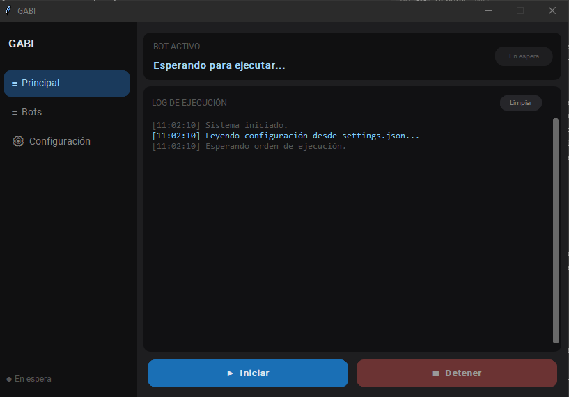
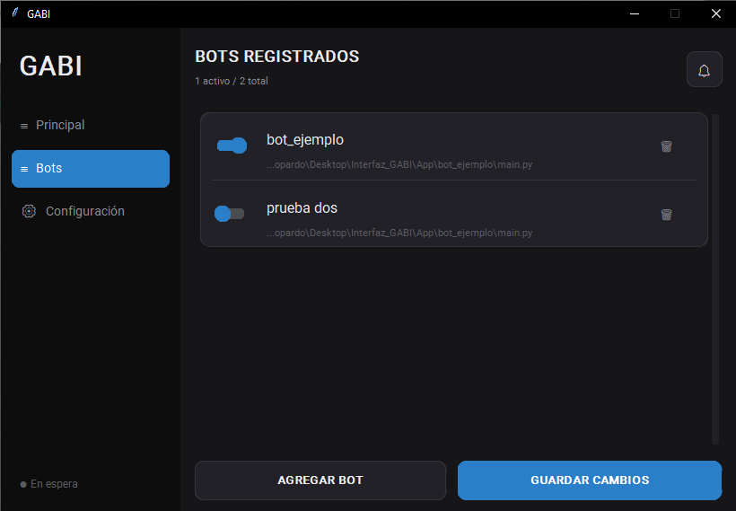

# Interfaz_GABI

Interfaz de escritorio para ejecutar bots de RPA, con logs en vivo, notificaciones por mail y configuración editable desde la aplicación propia.

> **Sobre este proyecto:** GABI nació como una herramienta interna que desarrollé en mi trabajo para poder orquestar la ejecución de bots de automatización. Se usa de forma productiva y permitio reducir tareas manuales de forma significativa. Este repositorio es una **versión adaptada y genérica** de esa herramienta, preparada para mostrarse públicamente: no contiene bots reales ni datos de la empresa, sino una interfaz funcional con un mini bot de ejemplo para probar el flujo completo.
 
---
 
## ¿Qué hace?
 
GABI centraliza la ejecución de varios bots desde una sola ventana. En lugar de correr cada script a mano por consola, permite registrarlos, activarlos y ejecutarlos con un botón, mientras muestra en tiempo real qué está pasando (logs).
 
Sus funciones principales:
 
- **Ejecución de bots** uno tras otro, en un hilo separado para que la interfaz no se congele.
- **Log en vivo** con colores según el tipo de mensaje (info, éxito, advertencia, error).
- **Notificaciones por mail** al terminar cada bot, con un reporte del resultado (éxito/error, duración, equipo).
- **Configuración editable** desde la interfaz, sin tocar código: credenciales, destinatarios, y las variables propias de cada bot.
- **Registro de logs** en disco, un archivo por día.
---
 
## Capturas
**Panel principal — ejecución y log en vivo**
 

 
**Gestión de bots**
 

 
**Configuración (global + variables por bot)**
 

 
---
 
## Estructura del proyecto
 
```
GABI/
├── App/                      # Bots ejecutables (cada uno con su propia lógica)
│   └── bot_ejemplo/
│       └── main.py           # Bot de ejemplo para probar GABI
|
├── config/
│   ├── config_sistema.py     # Constantes de sistema (host/puerto SMTP, rutas)
│   ├── almacenamiento.py     # Lectura/escritura del settings.json
│   ├── settings.json         # Configuración real (NO se versiona)
│   └── settings.example.json # Plantilla de configuración
|
├── core/                     # Núcleo del sistema
│   ├── runner.py             # Ejecuta los bots y captura su salida
│   └── notificador.py        # Envío de mails de reporte
|
├── ui/                       # Interfaz
│   ├── main_window.py        # Ventana raíz + navegación
│   └── panels/
│       ├── panel_main.py     # Ejecución y log
│       ├── panel_bots.py     # Alta/baja/activación de bots
│       └── panel_config.py   # Configuración editable
|
├── Statics/                  # Recursos (logo, íconos)
├── main.py                   # Punto de entrada
└── requirements.txt
```
 
---
 
## Configuración
 
GABI separa la configuración en dos niveles:
 
- **Constantes de sistema** (`config/config_sistema.py`): valores que definen cómo funciona GABI y que solo cambia quien desarrolla (host y puerto SMTP, rutas internas). No se editan desde la interfaz.
- **Configuración editable** (`config/settings.json`): valores operativos que el usuario ajusta desde la app.
El `settings.json` tiene esta forma:
 
```json
{
  "app":   { "nombre_bot": "GABI", "equipo": "" },
  "smtp":  { "user": "", "pass": "", "mail_destino": "", "notif_mail": false },
  "rutas": { "logs": "data/logs" },
  "bots":  [
    {
      "nombre": "BotEjemplo",
      "ruta": "App/bot_ejemplo/main.py",
      "activo": false,
      "config": { }
    }
  ]
}
```
 
- La sección **`app` / `smtp` / `rutas`** es la configuración global, editable desde la zona superior del panel de Configuración.
- Cada bot tiene su propio bloque **`config`** con sus variables. El usuario edita esos valores desde la interfaz (si hay más de un bot, aparecen en pestañas).
- Para **agregar una variable nueva** a un bot, se añade la clave dentro de su `config` en el `settings.json`. La estructura la define quien desarrolla; los valores los ajusta el usuario.
> El `settings.json` real está en `.gitignore` porque puede contener credenciales. En el repositorio se versiona solo `settings.example.json` como plantilla.
 
---
 
## Uso
 
```bash
python main.py
```
 
1. En **Bots**, registrá los scripts que querés ejecutar (o usá el bot de ejemplo que ya viene cargado) y activá los que quieras correr.
2. En **Configuración**, completá los datos de mail si querés notificaciones, y ajustá las variables de cada bot.
3. En **Principal**, tocá **Iniciar** y seguí la ejecución en el log en vivo.
### Probar con el bot de ejemplo
 
El repositorio incluye `App/bot_ejemplo/main.py`, un bot autónomo que simula un proceso real (imprime su progreso y espera entre pasos). Sirve para ver GABI funcionando de punta a punta sin necesidad de un bot productivo.
 
Para ver cómo GABI reporta un error, el bot de ejemplo puede simular un fallo a mitad de camino ejecutándose con el argumento `--fallar`.
 
### Agregar tu propio bot
 
Un bot de GABI es cualquier script `.py` que:
 
1. Imprima su progreso por `stdout` (opcionalmente con los prefijos `INFO:`, `LOG:`, `WARN:`, `ERROR:` que GABI colorea).
2. Termine con código de salida `0` si todo salió bien, o distinto de `0` si falló.
Con eso, GABI lo ejecuta, captura su salida y reporta el resultado. Podés tomar `App/bot_ejemplo/main.py` como base.
 
---
 
## Licencia
 
Este proyecto está bajo licencia MIT. Ver el archivo [LICENSE](LICENSE) para más detalles.
 
---
 
Desarrollado por **Martina Lopardo** — [github.com/lopardomartina](https://github.com/lopardomartina)
 